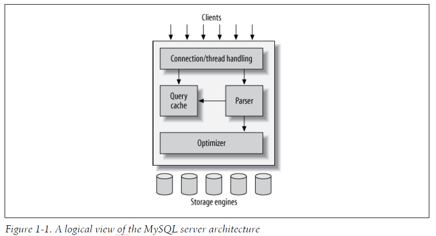

# MySQL’s Logical Architecture

## Logical view of MySQL’s architecture

A good mental picture of how MySQL’s components work together will help you understand the server. Figure 1-1 shows a logical view of MySQL’s architecture.

### Topmost layer 

The topmost layer contains the services that aren’t unique to MySQL. They’re services most network-based client/server tools or servers need: connection handling, authentication, security, and so forth.

### The second layer 

The second layer is where things get interesting. Much of MySQL’s brains are here, including the code for query parsing, analysis, optimization, caching, and all the built-in functions (e.g., dates, times, math, and encryption). Any functionality provided across **storage engines** lives at this level: 

stored procedures, triggers, and views, for example.

### The third layer 

> NOTE: 
>
> "program to an abstraction and polymorphism-consistent API"
>
> "Information hiding-separate隔离 interface from implementation"

The third layer contains the storage engines. They are responsible for storing and retrieving all data stored “in” MySQL. Like the various filesystems available for GNU/Linux, each storage engine has its own benefits and drawbacks. The server communicates with them through the **storage engine API**. This interface hides differences between storage engines and makes them largely transparent at the query layer. The API contains a couple of dozen low-level functions that perform operations such as “begin a transaction” or “fetch the row that has this primary key.” The storage engines don’t parse SQL $^1$​ or communicate with each other; they simply respond to requests from the server.

> 1、One exception is InnoDB, which does parse foreign key definitions, because the MySQL server doesn’t yet implement them itself.

## Connection Management and Security

Each client connection gets its own thread within the server process. The connection’s queries execute within that single thread, which in turn resides on one core or CPU. The server caches threads, so they don’t need to be created and destroyed for each new connection.$^2$

> 2、MySQL 5.5 and newer versions support an API that can accept thread-pooling plugins, so a small pool of threads can service many connections.

> NOTE: 
>
> 一、从最后一段话可知，MySQL的实现采用了thread pool；从倒数第二段可知，MySQL的实现，可能采用了**绑核**
>
> 读完了第一段话，我的想法是: 这种一个connection一个thread并发方式，能否解决C10K问题？但是后面的论述，又表明显然不是一个thread一个connection；那真实的情况是怎样的呢？

When clients (applications) connect to the MySQL server, the server needs to authenticate them. Authentication is based on username, originating host, and password.

## Optimization and Execution

> NOTE: 
>
> Optimization 可以说涉及方方面面
>
> 

The optimizer does not really care what storage engine a particular table uses, but the storage engine does affect how the server optimizes the query. The optimizer asks the storage engine about some of its capabilities and the cost of certain operations, and for statistics on the table data. For instance, some storage engines support **index types** that can be helpful to certain queries. You can read more about **indexing** and **schema optimization** in Chapter 4 and Chapter 5.

> NOTE: 
>
> 上面这段话描述了optimizer和storage engine之间的关系

